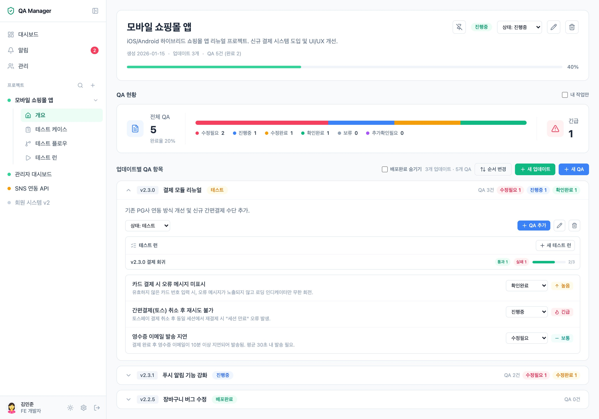

# QA Manager

[한국어](README.md) | **English**

> A full-stack web service for managing your team's QA workflow — projects → updates (releases) → QA items.
> Real-time notifications (SSE), an MS Teams bot, and GitHub issue/commit tracking cover the entire in-house QA collaboration loop.


**🔗 Live demo: https://qa-manager-demo.cygnus2.com**
A static demo that runs without a backend (your changes are stored only in your browser). Click a demo account on the login screen to jump right in. The demo auto-detects your browser language — the full English UI and English seed data are included. → [Demo mode docs](docs/DEMO.md) (Korean)

---

## Screenshots

<!--
  Screenshots are picked up automatically when placed in docs/images/ with the file names below.
  Recommended capture list: see docs/images/README.md (Korean)
-->

| Dashboard (sidebar + summary card)      | QA detail (three-pane view · sidebar auto-collapses) |
|----------------------------------------|---------------------------------------|
|  |  |

| Project detail (sidebar tree · QA per update)  | Settings (Discord-style full screen)     |
|------------------------------------------------|------------------------------------------|
|  |  |

| Comments · Mentions · Emoji reactions   | GitHub issue & commit tracking                 |
|-----------------------------------------|------------------------------------------------|
|  |  |

| Workflow graph → auto-generated cases      | Test run (per-platform execution)      |
|--------------------------------------------|----------------------------------------|
|   |   |

| Notifications page (list │ QA content)            | Email OTP two-step login                  |
|---------------------------------------------------|-------------------------------------------|
|    |  |

---

## Features

The full feature guide, screen by screen, lives in **[docs/FEATURES.md](docs/FEATURES.md)** (Korean).

### QA workflow
- Three-level structure: project → update (release) → QA item, with drag-and-drop reordering of updates
- Six QA statuses (Needs Fix → In Progress → Fixed → Verified / On Hold / Recheck) plus four priority levels
- Ownership model: one tester + two assignees, changeable inline right from the list
- Automatic field-level change history, `#id` cross-reference tags between QA items (autocomplete + rendered links)
- QA detail is a three-pane view — list sidebar / body & comments / change history — with filters and prev/next navigation kept in sync with the list

### Test case management
- Project-level case library — suites (folders) + step editing (action / expected result), with a **list ↔ flow (graph) view toggle**
- **Workflow graph editor** — draw your product workflows as nodes (screens / actions / branches), and it enumerates every start-to-end path to auto-generate scenario test cases (model-based testing). When the graph changes, derived cases are flagged "flow changed"
- **Test runs** — execute a snapshot of cases per update (release) with pass/fail/blocked/skipped, progress and stats, and one-click creation and linking of a QA item from a failure
- **Per-platform execution** — select PC/Android/iOS when creating a run → entries expand to case × platform, each with its own result, notes, and QA link, plus a platform filter

### Collaboration
- Comments with one-level replies, `@mention` autocomplete, 8 emoji reactions, submit with `Ctrl+Enter`
- Image and PDF attachments (paste from clipboard) with a wheel-zoom/drag lightbox

### Layout
- **App sidebar** — menu (dashboard/notifications/admin) + project tree (pinned first, new-notification badges, per-project overview/test cases/flows/runs sub-menu). Collapses to an icon strip with `⌘B`, **collapses automatically on QA detail**, becomes a drawer on mobile
- **Dashboard** — a single QA status summary card (total, completion rate, status ratio bar, critical) + the full QA list (with a project column)
- **Discord-style settings** — user settings (account/notifications/MS Teams), app settings (appearance/language/desktop app) and admin (members/GitHub) on a full-screen page, closed with `ESC`

### Notifications
- In-app real-time notifications (SSE) — six types: QA created, status changed, assignee assigned, comment, reply, mention
- Each notification has a **title (the QA title) and a body** — comment/reply/mention bodies include an excerpt of the comment
- **MS Teams bot** proactive 1:1 messages (Adaptive Cards + deep links) — per-type on/off and quiet hours
- **Notifications page** — list on the left (all/unread/mentions filter, mark all as read) | the selected notification's QA item and comments on the right. **Opening a QA detail page marks its notifications as read**
- Automatic SSE reconnection plus a server keep-alive — notifications keep flowing even when the app stays open for hours

### GitHub integration
- **GitHub App Manifest flow** — create and connect a dedicated GitHub App in one click from the admin screen
- Automatically creates a GitHub issue when a QA item is filed, and syncs issue open/close with QA status changes
- Put `#issue-number` in a commit message and the related commits appear on the QA detail page

### Security
- **Account roles (admin/member)** — only admins can access the admin pages, manage members, grant roles, and configure global integrations (GitHub). The admin group in settings is shown to admins only
- JWT in HttpOnly cookies + refresh rotation + Redis token blacklist
- **IP-conditional email OTP 2FA** — a 6-digit email code is required only for logins from outside trusted IPs (e.g. the office)
- API audit log (every write request recorded), X-Forwarded-For trust-boundary handling, CSP and other security headers

### Desktop app
- **[qa-manager-desktop](https://github.com/cygnus970209/qa-manager-desktop)** (Tauri) — a lightweight desktop shell: add your server URL and connect. Stays in the tray with **native OS notifications and a dock badge** (notifications keep arriving even with the window closed), and **clicking a notification jumps straight to the QA item**
- macOS (Universal, Developer ID signed and notarized) / Windows / Linux — download from [Releases](https://github.com/cygnus970209/qa-manager-desktop/releases); the app **updates itself** afterwards
- When the server (web app) is redeployed, a "new version · reload" banner appears inside the app, so there is no need to restart it (`⌘R`/`F5` reloads too)

### Operations
- Admin area (projects/QA management) + member management in settings, with a step-by-step Teams delivery diagnostic tool
- Full-stack Docker Compose deployment (DB + Redis + BE + FE) with Flyway migrations applied automatically
- Built-in **demo mode** build that runs as a static site with no backend
- **i18n (Korean/English)** — auto-detects the browser language and remembers it via cookie, with instant switching from Settings > Language or the login screen. Even the demo seed data is provided per language
- **Dark mode** — follows the OS setting (system/light/dark three-way toggle), supported on every screen, no FOUC

---

## Tech stack

| Area | Stack |
|---|---|
| Frontend | Nuxt 4 (SSR), Vue 3, Pinia, Tailwind CSS (dark mode), TypeScript strict, @nuxtjs/i18n (ko/en), Vue Flow (workflow editor) |
| Backend | Spring Boot 4, Java 25 (virtual threads), Spring Security, JPA/Hibernate |
| DB / Cache | MariaDB 11 + Flyway (V1–V14), Redis 7 (token blacklist · OTP) |
| Auth | JWT (HttpOnly cookies, access + refresh rotation), email OTP 2FA |
| Storage | AWS S3 — direct browser uploads via presigned URLs |
| Real-time | SSE (subscribed via fetch + ReadableStream) |
| Integrations | GitHub App (issues/commits), MS Teams Bot Framework, SMTP |
| Deployment | Docker Compose / systemd / Nginx (sample configs included) |

---

## Architecture highlights

The structure and the reasoning behind the technical decisions are laid out in **[docs/ARCHITECTURE.md](docs/ARCHITECTURE.md)** (Korean).

- **Event-driven side-effect isolation** — Teams delivery, GitHub issue creation, and audit logging run through `ApplicationEvent` + `@Async` + `afterCommit`, decoupled from the main transaction. An external API outage never blocks saving a QA item
- **SSE subscribed via fetch + ReadableStream** — works around `EventSource`'s inability to handle HttpOnly cookies/headers
- **S3 presigned uploads** — files never pass through the server, and `contentLength` is part of the signature, so S3 rejects any upload that doesn't match the declared size
- **GitHub App Manifest flow** — even self-hosted installs create the app from the admin screen with zero environment variables; credentials are stored in the DB. Converts PKCS#1 PEM to PKCS#8 without external libraries
- **In-house JWT verification for Teams webhooks** — verifies Bot Framework OpenID JWKS signatures and matches the serviceUrl claim to block forged requests
- **XFF trust boundary** — for OTP trusted-IP decisions, X-Forwarded-For is parsed "as many trusted proxies from the right" to prevent header spoofing

---

## Project structure

```
qa-manager/
├── frontend/                    # Nuxt 4 (production: SSR / demo: static SPA)
│   ├── app/
│   │   ├── components/          # base (shared UI) · feature (domain)
│   │   ├── composables/         # useQa, useGithub, useUpload, …
│   │   ├── demo/                # demo-mode mock backend (localStorage)
│   │   ├── pages/               # /, /project/:id, /qa/:id, /admin, /auth/login
│   │   ├── stores/              # auth, notifications (Pinia)
│   │   └── types/               # 1:1 types for backend DTOs
│   ├── Dockerfile               # production SSR
│   └── Dockerfile.demo          # demo static serving (nginx)
├── backend/                     # Spring Boot 4 · Java 25
│   └── src/main/
│       ├── java/com/qamanager/
│       │   ├── auth/            # JWT · cookies · blacklist / otp: email OTP 2FA
│       │   ├── audit/           # API request audit log
│       │   ├── project/ projectupdate/
│       │   ├── qa/              # item · comment · shared
│       │   ├── notification/    # in-app + SSE / teams: Teams bot
│       │   ├── integration/github/  # GitHub App integration
│       │   └── member/ file/ config/ common/
│       └── resources/db/migration/  # Flyway V1–V14
├── teams-app/                   # Teams app manifest package
├── docs/                        # 📚 documentation wiki (see "Documentation" below)
├── docker-compose.yml           # production full stack (DB + Redis + BE + FE)
├── docker-compose.demo.yml      # demo only (single static SPA container)
└── .env.example                 # environment variable template (commented per entry)
```

---

## Quick start

### Option A: Docker Compose (recommended)

```bash
cp .env.example .env       # fill in JWT_SECRET, DB_PASSWORD, AWS keys, etc.
docker compose up -d --build
```

- Frontend: `http://localhost:3247`
- Backend: `http://localhost:8357` (Swagger: `/swagger-ui.html`)
- Log in with a seed account (e.g. `kimminjun` / `1234` — disable seeding for production deployments)

### Option B: Run directly on the host

Prerequisites: JDK 25 · Node ≥ 22.12 · MariaDB 11 · Redis · an AWS S3 bucket

```bash
cp .env.example .env       # adjust DB_HOST=localhost, etc.

cd backend && ./gradlew bootRun          # http://localhost:8080

cd frontend && npm install && npm run dev  # http://localhost:3000
```

### Demo build (no backend)

```bash
cd frontend
DEMO_BUILD=true npm run generate     # → statically host .output/public
# or: docker compose -f docker-compose.demo.yml up -d --build
```

For detailed steps, reverse proxy setup, backups, and troubleshooting, see [docs/DEPLOYMENT.md](docs/DEPLOYMENT.md) (Korean).

---

## Documentation

The docs below are currently written in Korean.

| Document | Contents |
|---|---|
| [docs/README.md](docs/README.md) (Korean) | 📚 **Wiki home** — reading guide per audience |
| [docs/FEATURES.md](docs/FEATURES.md) (Korean) | Detailed feature guide (screen by screen) |
| [docs/ARCHITECTURE.md](docs/ARCHITECTURE.md) (Korean) | System architecture · technical decisions · DB schema history |
| [docs/API.md](docs/API.md) (Korean) | REST API reference |
| [docs/GITHUB_INTEGRATION.md](docs/GITHUB_INTEGRATION.md) (Korean) | GitHub App setup and how the integration works |
| [docs/TEAMS_INTEGRATION.md](docs/TEAMS_INTEGRATION.md) (Korean) | MS Teams bot notification setup guide |
| [docs/DEMO.md](docs/DEMO.md) (Korean) | How demo mode works · deployment |
| [docs/DEPLOYMENT.md](docs/DEPLOYMENT.md) (Korean) | Deployment · operations · troubleshooting |
| [docs/SECURITY_IP_OTP_LOGIN.md](docs/SECURITY_IP_OTP_LOGIN.md) (Korean) | IP-conditional email OTP design doc |

---

## Environment variables

Every variable is documented with comments in `.env.example`. The essentials:

| Key | Notes |
|---|---|
| `DB_*` / `REDIS_*` | MariaDB · Redis connection |
| `JWT_SECRET` | Random, **64+ characters** (`openssl rand -hex 48`). Boot fails if unset |
| `AWS_*` | S3 presigned uploads |
| `UPLOAD_MAX_FILE_SIZE_MB` | Attachment size limit (default 100MB, injected into both FE and BE) |
| `TEAMS_*` | Teams bot (disabled by default) → [setup guide](docs/TEAMS_INTEGRATION.md) (Korean) |
| `SECURITY_IP_OTP_*` / `SMTP_*` | Email OTP 2FA (disabled by default) |
| `NUXT_PUBLIC_API_BASE` | Backend URL **reachable from the browser** |

> ⚠️ Never commit `.env`. GitHub App credentials are not environment variables — they are created through the Manifest flow in the admin screen and stored in the DB.
