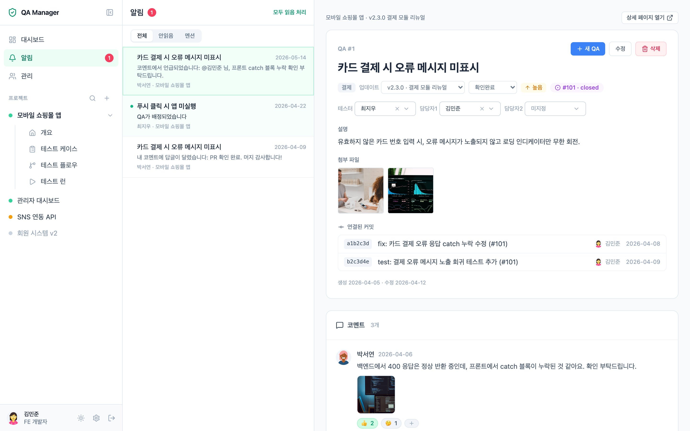
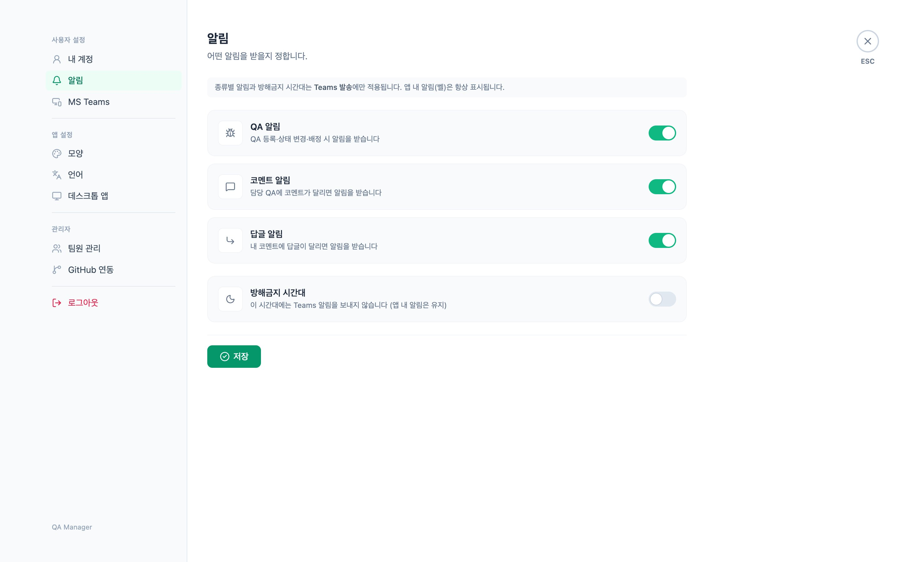

# QA Manager

**한국어** | [English](README.en.md)

프로젝트 → 업데이트(버전) → QA 항목으로 이어지는 팀 QA 워크플로 관리 서비스입니다.
실시간 알림, MS Teams 봇, GitHub 이슈·커밋 추적, 테스트 케이스와 테스트 런까지 사내 QA 협업을 한곳에서 다룹니다.


**🔗 라이브 데모: https://qa-manager-demo.cygnus2.com** — 백엔드 없이 동작하는 정적 데모. 로그인 화면에서 데모 계정을 클릭하면 바로 체험할 수 있습니다.

## 스크린샷

| 대시보드                               | QA 상세                                |
|----------------------------------------|----------------------------------------|
|  |   |

| 알림                                          | 설정                              |
|-----------------------------------------------|-----------------------------------|
|  |  |

| 워크플로우 그래프 → 테스트 케이스           | 테스트 런                              |
|---------------------------------------------|----------------------------------------|
|  |  |

## 주요 기능

- **QA 워크플로** — 프로젝트 → 업데이트 → QA 항목. 상태 6단계 · 우선순위 4단계, 테스터 + 담당자 2인, 변경 이력, `#번호` 상호참조
- **테스트 케이스 · 테스트 런** — 스위트/스텝 편집, 워크플로우 그래프에서 케이스 자동 생성, 릴리즈별 실행(PC/Android/iOS)과 실패 → QA 연결
- **협업** — 코멘트 · 답글 · `@멘션` · 이모지 반응, 이미지/PDF 첨부
- **알림** — 인앱 실시간(SSE) + MS Teams 봇 1:1 메시지. 알림 페이지에서 목록과 QA 내용을 나란히 확인
- **GitHub 연동** — QA 등록 시 이슈 자동 생성 · 상태 동기화, 커밋 메시지의 `#번호` 로 커밋 추적
- **화면** — 프로젝트 트리 사이드바(`⌘B` 접기), Discord 식 설정 화면, 다크모드, 한국어/영어
- **데스크톱 앱** — [qa-manager-desktop](https://github.com/cygnus970209/qa-manager-desktop) (Tauri). 네이티브 알림 · 자동 업데이트
- **보안 · 운영** — 관리자/멤버 권한, IP 조건부 이메일 OTP, API 감사 로그, Docker Compose 무중단 배포, 데모 모드 빌드

화면별 상세 설명은 [docs/FEATURES.md](docs/FEATURES.md) 를 보세요.

## 기술 스택

| 영역 | 스택 |
|---|---|
| Frontend | Nuxt 4 (SSR) · Vue 3 · Pinia · Tailwind CSS · TypeScript · Vue Flow |
| Backend | Spring Boot 4 · Java 25 · Spring Security · JPA |
| 데이터 | MariaDB 11 (Flyway) · Redis 7 · AWS S3 |
| 연동 · 배포 | SSE · GitHub App · MS Teams Bot Framework · Docker Compose · Nginx |

## 빠른 시작

```bash
cp .env.example .env          # JWT_SECRET, DB, AWS 값 채우기
docker compose up -d --build  # 프론트 http://localhost:3247 · 백엔드 http://localhost:8357
```

시드 계정 `kimminjun` / `1234` 로 로그인할 수 있습니다.
호스트 직접 실행, 무중단 배포(`./deploy.sh`), 리버스 프록시, 백업은 [docs/DEPLOYMENT.md](docs/DEPLOYMENT.md) 를 보세요.

## 문서

| 문서 | 내용 |
|---|---|
| [docs/README.md](docs/README.md) | 문서 위키 홈 — 독자별 읽기 가이드 |
| [docs/FEATURES.md](docs/FEATURES.md) | 기능 상세 가이드 (화면별) |
| [docs/ARCHITECTURE.md](docs/ARCHITECTURE.md) | 시스템 구성 · 저장소 구조 · 기술 결정 · DB 스키마 히스토리 |
| [docs/API.md](docs/API.md) | REST API 레퍼런스 |
| [docs/DEPLOYMENT.md](docs/DEPLOYMENT.md) | 배포 · 환경변수 · 운영 · 트러블슈팅 |
| [docs/GITHUB_INTEGRATION.md](docs/GITHUB_INTEGRATION.md) | GitHub App 연동 |
| [docs/TEAMS_INTEGRATION.md](docs/TEAMS_INTEGRATION.md) | MS Teams 봇 알림 |
| [docs/DEMO.md](docs/DEMO.md) | 데모 모드 |
| [docs/SECURITY_IP_OTP_LOGIN.md](docs/SECURITY_IP_OTP_LOGIN.md) | IP 조건부 이메일 OTP 설계 |
