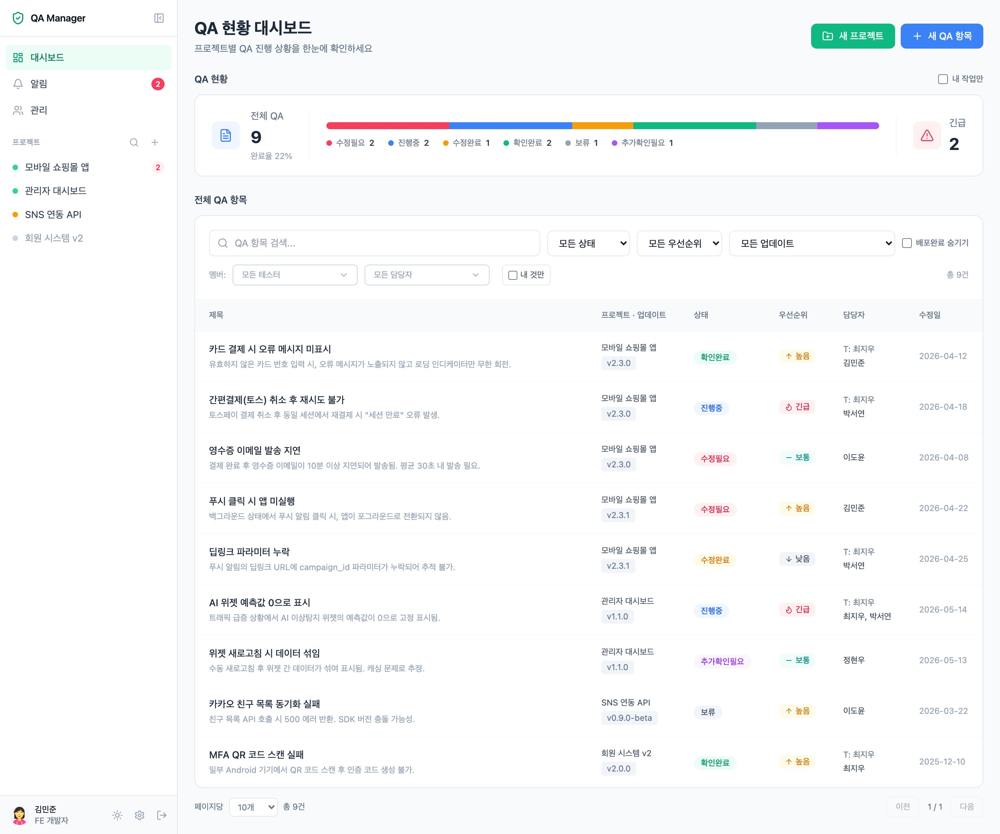
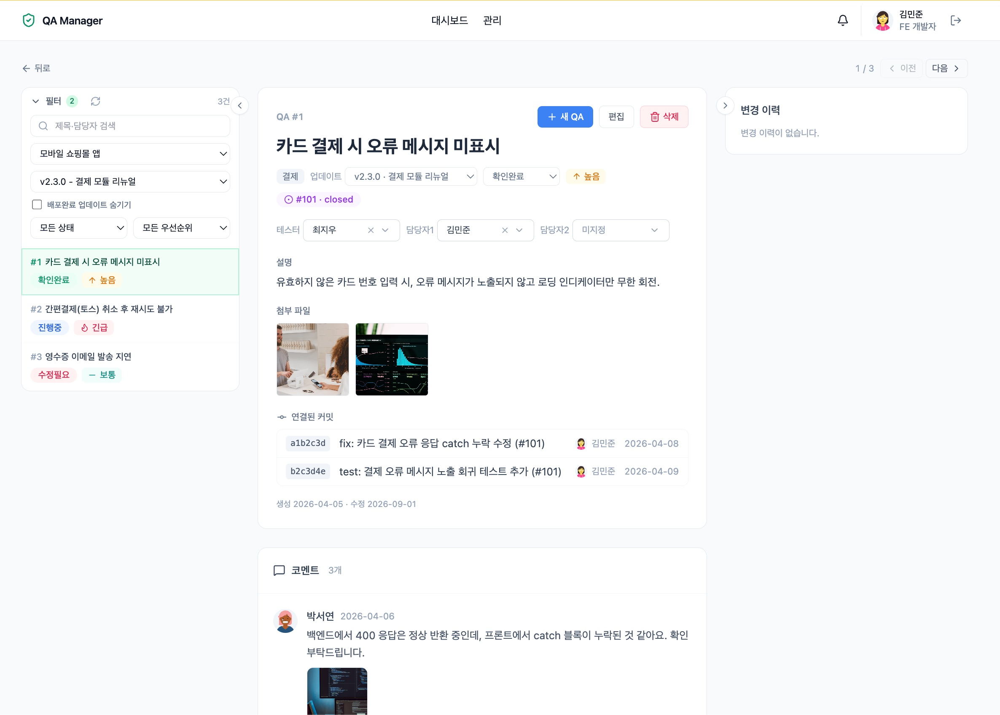
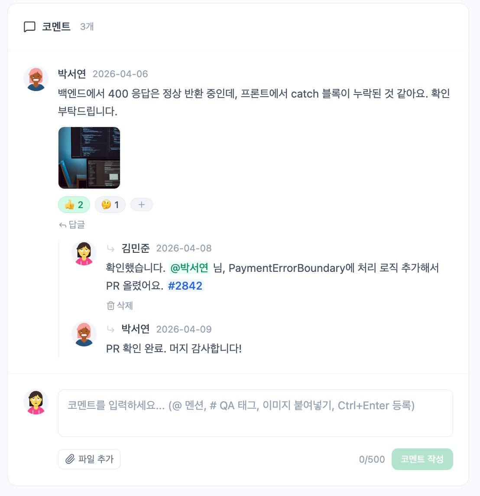
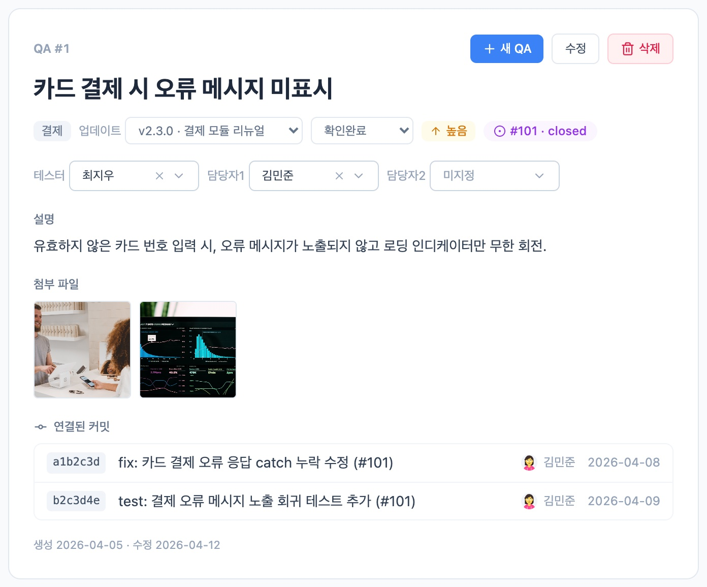
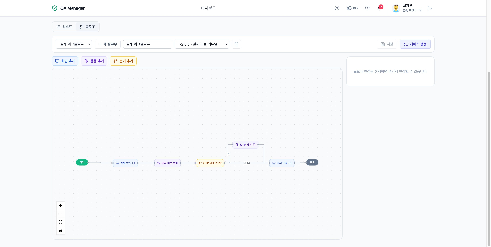
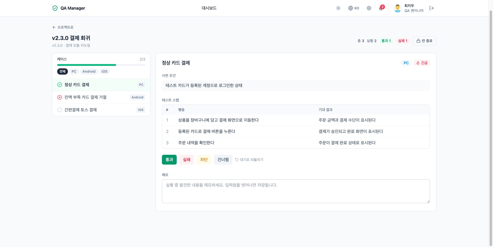
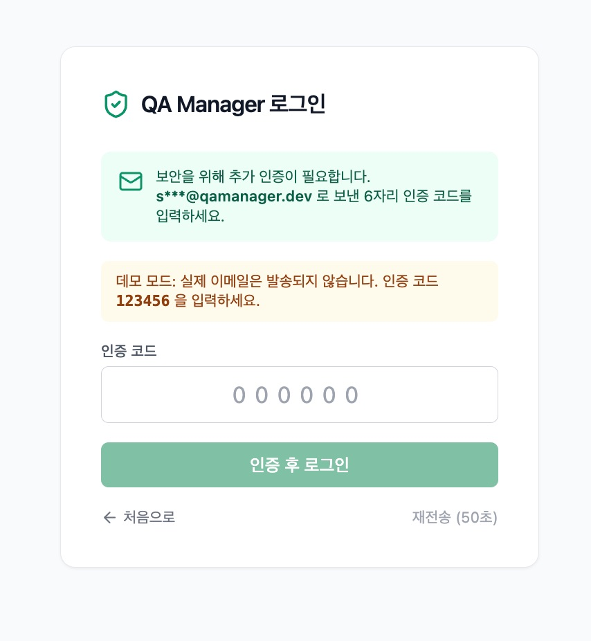

# QA Manager

**한국어** | [English](README.en.md)

> 프로젝트 → 업데이트(버전) → QA 항목으로 이어지는 팀 QA 워크플로 관리 풀스택 웹 서비스.
> 실시간 알림(SSE) · MS Teams 봇 · GitHub 이슈/커밋 추적까지, 사내 QA 협업 흐름 전체를 다룹니다.


**🔗 라이브 데모: https://qa-manager-demo.cygnus2.com**
백엔드 없이 동작하는 정적 데모입니다(변경 사항은 방문자 브라우저에만 저장). 로그인 화면에서 데모 계정을 클릭하면 바로 체험할 수 있습니다. → [데모 모드 문서](docs/DEMO.md)

---

## 스크린샷

<!--
  스크린샷은 docs/images/ 에 아래 파일명으로 넣으면 자동으로 표시됩니다.
  권장 캡처 목록: docs/images/README.md 참고
-->

| 대시보드                             | QA 상세 (3분할 뷰)                    |
|--------------------------------------|---------------------------------------|
|  |  |

| 코멘트 · 멘션 · 이모지 반응            | GitHub 이슈 · 커밋 추적                        |
|----------------------------------------|------------------------------------------------|
|  |  |

| 워크플로우 그래프 → 케이스 자동 생성        | 테스트 런 (플랫폼별 실행)              |
|---------------------------------------------|----------------------------------------|
|  |  |

| 실시간 알림센터                                  | 이메일 OTP 2단계 로그인                  |
|--------------------------------------------------|------------------------------------------|
|  |  |

---

## 주요 기능

전체 기능의 상세 설명과 화면별 가이드는 **[docs/FEATURES.md](docs/FEATURES.md)** 에 있습니다.

### QA 워크플로
- 프로젝트 → 업데이트(릴리즈 버전) → QA 항목 3단 구조, 업데이트 드래그 순서 변경
- QA 상태 6단계(수정필요 → 진행중 → 수정완료 → 확인완료 / 보류 / 추가확인필요) + 우선순위 4단계
- 담당 구조: 테스터 1명 + 담당자 2명, 목록에서 인라인 즉시 변경
- 필드 단위 변경 이력 자동 기록, `#번호` QA 상호참조 태그(자동완성 + 링크 렌더링)
- QA 상세는 목록 사이드바 / 본문·코멘트 / 변경 이력 3분할 뷰 — 필터와 이전/다음 내비게이션이 목록과 동기화

### 테스트 케이스 관리
- 프로젝트급 케이스 라이브러리 — 스위트(폴더) + 스텝(행동/기대 결과) 편집, **리스트 ↔ 플로우(그래프) 뷰 전환**
- **워크플로우 그래프 에디터** — 기획 워크플로우를 노드(화면/행동/분기)로 그리면 시작→종료 경로를 열거해 시나리오 테스트 케이스 자동 생성 (모델 기반 테스팅). 그래프 변경 시 파생 케이스에 "플로우 변경됨" 표시
- **테스트 런** — 업데이트(릴리즈)별 케이스 스냅샷 실행(통과/실패/차단/건너뜀), 진행률·통계, 실패 → QA 항목 원클릭 생성·연결
- **플랫폼별 실행** — 런 생성 시 PC/Android/iOS 다중 선택 → 케이스 × 플랫폼으로 실행 항목 확장, 플랫폼별 결과·메모·QA 링크 독립 기록 + 플랫폼 필터

### 협업
- 코멘트 + 1-depth 답글, `@멘션` 자동완성, 이모지 반응 8종, `Ctrl+Enter` 등록
- 이미지·PDF 첨부(클립보드 붙여넣기 지원) + 휠 줌/드래그 라이트박스

### 화면 구성
- **앱 사이드바** — 메뉴(대시보드/알림/관리) + 프로젝트 트리(고정 우선, 새 알림 배지, 프로젝트별 개요·테스트 케이스·플로우·런 하위 메뉴). `⌘B` 로 아이콘 스트립으로 접힘, **QA 상세에서는 자동 접힘**, 모바일은 드로어
- **대시보드** — QA 현황 요약 카드 1장(총건수·완료율·상태 비율 바·긴급) + 전체 QA 목록(프로젝트 열 포함)
- **Discord 식 설정 화면** — 사용자 설정(내 계정/알림/MS Teams) · 앱 설정(모양/언어/데스크톱 앱) · 관리자(팀원 관리/GitHub 연동)를 전체 화면에서, `ESC` 로 닫기

### 알림
- 인앱 실시간 알림 (SSE) — QA 등록/상태 변경/담당자 배정/코멘트/답글/멘션 6종
- 알림은 **제목(QA 제목) + 본문**으로 구성 — 코멘트/답글/멘션은 본문에 댓글 내용 발췌 포함
- **MS Teams 봇** 1:1 프로액티브 메시지 (Adaptive Card + 딥링크) — 종류별 on/off, 방해금지 시간대 설정
- **알림 페이지** — 왼쪽 목록(전체/안읽음/멘션 필터, 모두 읽음 처리) | 오른쪽에 고른 알림의 QA 정보·코멘트를 바로 표시. **QA 상세를 열면 그 QA 의 알림은 자동 읽음**
- SSE 가 끊겨도 자동 재연결 + 서버 keep-alive — 장시간 켜 두어도 알림이 끊기지 않음

### GitHub 연동
- **GitHub App Manifest flow** — 관리자 화면에서 원클릭으로 전용 GitHub App 생성·연동
- QA 등록 시 GitHub 이슈 자동 생성, QA 상태 변경 시 이슈 open/close 동기화
- 커밋 메시지에 `#이슈번호` 를 남기면 QA 상세에 관련 커밋이 자동 표시

### 보안
- **계정 권한 (관리자/멤버)** — 관리자만 관리 페이지 접근·팀원 관리·권한 부여·전역 연동(GitHub) 설정 가능. 설정 화면의 관리자 묶음은 관리자에게만 노출
- JWT HttpOnly 쿠키 + refresh rotation + Redis 토큰 블랙리스트
- **IP 조건부 이메일 OTP 2FA** — 신뢰 IP(사무실) 밖 로그인에만 6자리 이메일 인증 요구
- API 감사 로그(쓰기 요청 전수 기록), X-Forwarded-For 신뢰 경계 처리, CSP 등 보안 헤더

### 데스크톱 앱
- **[qa-manager-desktop](https://github.com/cygnus970209/qa-manager-desktop)** (Tauri) — 서버 URL 을 추가해 접속하는 경량 데스크톱 셸. 트레이 상주 + **네이티브 OS 알림·독 뱃지**(창을 닫아도 알림 수신), **알림 클릭 시 해당 QA 로 바로 이동**
- macOS(Universal · Developer ID 서명·공증) / Windows / Linux — [Releases](https://github.com/cygnus970209/qa-manager-desktop/releases) 에서 내려받고, 이후에는 **앱이 스스로 업데이트**

### 운영
- 관리자 페이지(프로젝트/QA 관리) + 설정의 팀원 관리 · Teams 발송 단계별 진단 도구
- Docker Compose 풀스택 배포(DB + Redis + BE + FE), Flyway 마이그레이션 자동 적용
- 백엔드 없이 정적 호스팅되는 **데모 모드** 빌드 내장
- **다국어 지원 (한국어/영어)** — 브라우저 언어 자동 감지 + 쿠키 기억, 설정 > 언어/로그인 화면에서 즉시 전환. 데모 시드 데이터까지 언어별 제공
- **다크모드** — OS 설정 자동 추종(시스템/라이트/다크 3단 선택), 전 화면 지원, FOUC 방지

---

## 기술 스택

| 영역 | 스택 |
|---|---|
| Frontend | Nuxt 4 (SSR), Vue 3, Pinia, Tailwind CSS (다크모드), TypeScript strict, @nuxtjs/i18n (ko/en), Vue Flow (워크플로우 에디터) |
| Backend | Spring Boot 4, Java 25 (가상 스레드), Spring Security, JPA/Hibernate |
| DB / Cache | MariaDB 11 + Flyway (V1~V14), Redis 7 (토큰 블랙리스트 · OTP) |
| Auth | JWT (HttpOnly 쿠키, access + refresh rotation), 이메일 OTP 2FA |
| Storage | AWS S3 — presigned URL 브라우저 직접 업로드 |
| 실시간 | SSE (fetch + ReadableStream 구독) |
| 외부 연동 | GitHub App (이슈/커밋), MS Teams Bot Framework, SMTP |
| 배포 | Docker Compose / systemd / Nginx (예시 설정 포함) |

---

## 아키텍처 하이라이트

구조와 기술 결정의 배경은 **[docs/ARCHITECTURE.md](docs/ARCHITECTURE.md)** 에 정리되어 있습니다.

- **이벤트 기반 부수효과 격리** — Teams 발송·GitHub 이슈 생성·감사 로그는 `ApplicationEvent` + `@Async` + `afterCommit` 으로 본 트랜잭션과 분리. 외부 API 장애가 QA 저장에 영향을 주지 않음
- **SSE를 fetch + ReadableStream으로 구독** — `EventSource` 가 HttpOnly 쿠키/헤더를 다루지 못하는 한계 회피
- **S3 presigned 업로드** — 파일이 서버를 경유하지 않으며, `contentLength` 를 서명에 포함해 선언한 크기와 다른 업로드는 S3가 거부
- **GitHub App Manifest flow** — 셀프호스팅 환경에서도 환경변수 없이 관리자 화면에서 앱 생성 → 자격증명이 DB에 저장. PKCS#1 PEM을 외부 라이브러리 없이 PKCS#8로 변환
- **Teams 웹훅 자체 JWT 검증** — Bot Framework OpenID JWKS 서명 검증 + serviceUrl claim 대조로 위조 요청 차단
- **XFF 신뢰 경계** — OTP의 신뢰 IP 판정에 X-Forwarded-For를 "오른쪽에서 신뢰 프록시 수만큼" 파싱해 헤더 위조 방지

---

## 프로젝트 구조

```
qa-manager/
├── frontend/                    # Nuxt 4 (운영: SSR / 데모: 정적 SPA)
│   ├── app/
│   │   ├── components/          # base(공용 UI) · feature(도메인)
│   │   ├── composables/         # useQa, useGithub, useUpload, …
│   │   ├── demo/                # 데모 모드 mock 백엔드 (localStorage)
│   │   ├── pages/               # /, /project/:id, /qa/:id, /admin, /auth/login
│   │   ├── stores/              # auth, notifications (Pinia)
│   │   └── types/               # 백엔드 DTO 1:1 타입
│   ├── Dockerfile               # SSR 운영용
│   └── Dockerfile.demo          # 데모 정적 서빙용 (nginx)
├── backend/                     # Spring Boot 4 · Java 25
│   └── src/main/
│       ├── java/com/qamanager/
│       │   ├── auth/            # JWT · 쿠키 · 블랙리스트 / otp: 이메일 OTP 2FA
│       │   ├── audit/           # API 요청 감사 로그
│       │   ├── project/ projectupdate/
│       │   ├── qa/              # item · comment · shared
│       │   ├── notification/    # 인앱 + SSE / teams: Teams 봇
│       │   ├── integration/github/  # GitHub App 연동
│       │   └── member/ file/ config/ common/
│       └── resources/db/migration/  # Flyway V1~V14
├── teams-app/                   # Teams 앱 매니페스트 패키지
├── docs/                        # 📚 문서 위키 (아래 '문서' 참고)
├── docker-compose.yml           # 운영 풀스택 (DB + Redis + BE + FE)
├── docker-compose.demo.yml      # 데모 전용 (정적 SPA 단일 컨테이너)
└── .env.example                 # 환경변수 템플릿 (항목별 주석)
```

---

## 빠른 시작

### 옵션 A: Docker Compose (권장)

```bash
cp .env.example .env       # JWT_SECRET, DB_PASSWORD, AWS 키 등 채우기
docker compose up -d --build
```

- 프론트엔드: `http://localhost:3247`
- 백엔드: `http://localhost:8357` (Swagger: `/swagger-ui.html`)
- 시드 계정으로 로그인 가능 (예: `kimminjun` / `1234` — 운영 배포 시 시드 비활성화 권장)

### 옵션 B: 호스트에서 직접 실행

사전 준비: JDK 25 · Node ≥ 22.12 · MariaDB 11 · Redis · AWS S3 버킷

```bash
cp .env.example .env       # DB_HOST=localhost 등 조정

cd backend && ./gradlew bootRun          # http://localhost:8080

cd frontend && npm install && npm run dev  # http://localhost:3000
```

### 데모 빌드 (백엔드 없이)

```bash
cd frontend
DEMO_BUILD=true npm run generate     # → .output/public 을 정적 호스팅
# 또는: docker compose -f docker-compose.demo.yml up -d --build
```

상세 절차·리버스 프록시·백업·트러블슈팅은 [docs/DEPLOYMENT.md](docs/DEPLOYMENT.md) 참고.

---

## 문서

| 문서 | 내용 |
|---|---|
| [docs/README.md](docs/README.md) | 📚 **위키 홈** — 독자별 읽기 가이드 |
| [docs/FEATURES.md](docs/FEATURES.md) | 기능 상세 가이드 (화면별) |
| [docs/ARCHITECTURE.md](docs/ARCHITECTURE.md) | 시스템 아키텍처 · 기술 결정 · DB 스키마 히스토리 |
| [docs/API.md](docs/API.md) | REST API 레퍼런스 |
| [docs/GITHUB_INTEGRATION.md](docs/GITHUB_INTEGRATION.md) | GitHub App 연동 설정 · 동작 방식 |
| [docs/TEAMS_INTEGRATION.md](docs/TEAMS_INTEGRATION.md) | MS Teams 봇 알림 설정 가이드 |
| [docs/DEMO.md](docs/DEMO.md) | 데모 모드 동작 방식 · 배포 |
| [docs/DEPLOYMENT.md](docs/DEPLOYMENT.md) | 배포 · 운영 · 트러블슈팅 |
| [docs/SECURITY_IP_OTP_LOGIN.md](docs/SECURITY_IP_OTP_LOGIN.md) | IP 조건부 이메일 OTP 설계 문서 |

---

## 환경변수

`.env.example` 에 전 항목이 주석과 함께 정리되어 있습니다. 핵심만 요약:

| 키 | 비고 |
|---|---|
| `DB_*` / `REDIS_*` | MariaDB · Redis 접속 |
| `JWT_SECRET` | **64자 이상** 랜덤 (`openssl rand -hex 48`). 미설정 시 부팅 실패 |
| `AWS_*` | S3 presigned 업로드 |
| `UPLOAD_MAX_FILE_SIZE_MB` | 첨부 용량 제한 (기본 100MB, FE/BE 공통 주입) |
| `TEAMS_*` | Teams 봇 (기본 비활성) → [설정 가이드](docs/TEAMS_INTEGRATION.md) |
| `SECURITY_IP_OTP_*` / `SMTP_*` | 이메일 OTP 2FA (기본 비활성) |
| `NUXT_PUBLIC_API_BASE` | **브라우저에서 접근 가능한** 백엔드 URL |

> ⚠️ `.env` 는 절대 커밋하지 말 것. GitHub App 자격증명은 환경변수가 아니라 관리자 화면의 Manifest flow로 생성되어 DB에 저장됩니다.
