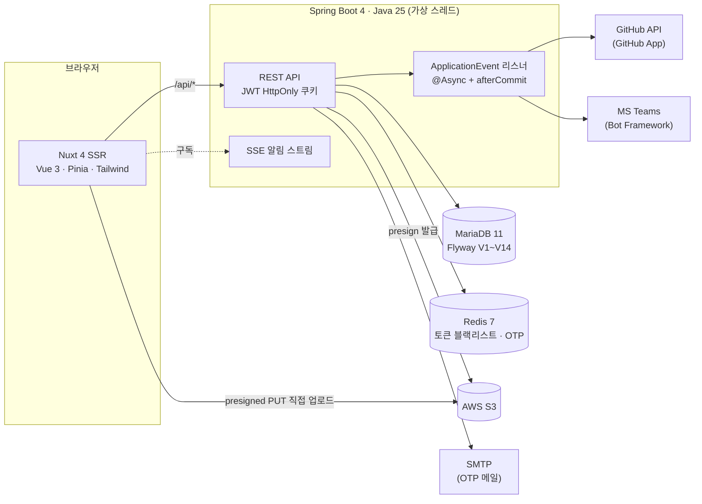

# 아키텍처

시스템 구성, 백엔드/프론트엔드 구조, 그리고 주요 기술 결정의 배경을 정리한 문서입니다.

## 1. 시스템 구성



- 운영 배포는 Docker Compose 4컨테이너(db · redis · backend · frontend), 앞단에 Nginx 리버스 프록시([예시 설정](nginx.example.conf))
- 데모 배포는 백엔드 없이 정적 SPA 단일 컨테이너 ([DEMO.md](DEMO.md))

## 2. 백엔드 구조

### 도메인별 수직 슬라이스

패키지를 계층(controller/service/…)이 아니라 **도메인 단위**로 나누고, 각 도메인 안에 Controller → Service → Repository → Entity + DTO 를 담습니다.

```
com.qamanager
├── auth/            # JWT 발급·검증, HttpOnly 쿠키, Redis 토큰 블랙리스트
│   └── otp/         # IP 조건부 이메일 OTP (2FA)
├── audit/           # API 요청 감사 로그 (비동기 적재)
├── member/          # 팀원 (소프트 삭제, Teams 연결 정보, 알림 개인화)
├── project/         # 프로젝트, 핀, GitHub repo 연결(1:N)
├── projectupdate/   # 업데이트(버전), 수동 정렬(sort_order)
├── qa/
│   ├── item/        # QA 항목, 이미지, 필드 단위 변경 이력
│   ├── comment/     # 코멘트, 답글, 이미지, 이모지 반응
│   └── shared/      # QaStatus(6단계), QaPriority(4단계)
├── notification/    # 인앱 알림 + SSE 레지스트리
│   └── teams/       # Teams 봇 (Graph 조회 + Bot Connector 발송 + 웹훅)
├── integration/github/  # GitHub App (Manifest flow, 이슈, 커밋 타임라인)
├── file/            # S3 presigned URL 발급
├── config/          # Security, Async, JPA
└── common/          # BaseEntity, ApiException, 전역 예외 핸들러
```

### 이벤트 기반 부수효과 격리

QA 저장 → Teams 발송/GitHub 이슈 생성 같은 외부 연동을 동기 호출하면 외부 장애가 본 기능을 깨뜨립니다. 그래서 도메인 간 결합을 Spring `ApplicationEvent` 로 끊고, 부수효과는 전부 다음 조합으로 격리했습니다.

```
QA 저장 트랜잭션 커밋
  └─ afterCommit ─→ @Async 리스너 ─→ REQUIRES_NEW 트랜잭션
                        ├─ Teams Adaptive Card 발송  (실패 → teams_send_log 기록)
                        ├─ GitHub 이슈 생성/동기화    (실패 → 로그만, QA 저장 무영향)
                        └─ 감사 로그 적재             (실패 → warn 후 무시)
```

- **커밋 후 실행**이므로 롤백된 데이터로 알림이 나가지 않음
- 실패는 각자 로그로 남기고 삼킴 — QA 저장의 성공 여부와 무관

### 인증 흐름

- Access(15분) / Refresh(14일) JWT 를 **HttpOnly 쿠키**로 발급 (XSS 로 토큰 탈취 불가), Authorization 헤더도 병행 지원
- Refresh **rotation**: 갱신 시 이전 refresh 의 jti 를 즉시 Redis 블랙리스트에 등록 (탈취 토큰 재사용 차단)
- 로그아웃 시 access + refresh 모두 블랙리스트, TTL 은 토큰 잔여 수명만큼만 보관
- Redis 장애 시에는 가용성 우선으로 통과 (블랙리스트 검사 skip)
- **IP 조건부 OTP**: 로그인 시 클라이언트 IP 가 신뢰 CIDR 밖이면 토큰 발급을 보류하고 이메일 6자리 코드 검증을 요구. OTP 는 BCrypt 해시로 Redis 에 TTL 저장 → 상세 설계: [SECURITY_IP_OTP_LOGIN.md](SECURITY_IP_OTP_LOGIN.md)

### 파일 업로드 흐름

```
브라우저 ──① POST /api/files/presigned (파일명·타입·크기)──→ 백엔드
        ←─② { uploadUrl, publicUrl } ──────────────────────
브라우저 ──③ PUT (파일 본문) ──────────────────────────────→ S3
        ──④ publicUrl 만 QA/코멘트에 저장 ─────────────────→ 백엔드
```

- 파일이 서버를 경유하지 않아 서버 대역폭/메모리 부담 없음
- 크기 검증 3중: 프론트 사전 검증 → presign 시 서버 검증 → **`contentLength` 를 서명에 포함**해 선언과 다른 크기의 PUT 은 S3 가 거부

## 3. 프론트엔드 구조

- **Nuxt 4 SSR** + 전역 인증 미들웨어. 하이드레이션 중에는 인증 부트스트랩을 건너뛰어 SSR/CSR 미스매치를 방지하고, refresh 쿠키가 있으면 리다이렉트를 보류하고 클라이언트 복구에 위임
- `$api` 플러그인 — `credentials: 'include'`, SSR 쿠키 forward, **401 시 refresh 자동 재시도**(동시 요청의 중복 refresh 합치기), 데모 빌드에서는 localStorage mock 으로 통째 교체
- 컴포넌트는 `base/`(범용 프리미티브 9종) 와 `feature/`(도메인 17종) 로 분리, composable 은 상태 없는 얇은 API 래퍼
- 타입(`app/types/api.ts`)은 백엔드 DTO 와 1:1 수기 매핑 (springdoc ↔ openapi-typescript 자동 생성 전환 예정)
- QA 목록 필터를 sessionStorage 로 상세 사이드바와 공유, 상세 간 이동은 `router.replace` 로 히스토리 오염 방지
- 보안 헤더/CSP 를 `routeRules` 로 전 응답에 부여 (GitHub App manifest 제출을 위한 `form-action https://github.com` 포함)

## 4. 실시간 알림 (SSE)

- 서버: `SseEmitterRegistry` 가 사용자별 emitter 목록을 관리 (`ConcurrentHashMap` + `CopyOnWriteArrayList`) — 다중 탭/기기 동시 구독, 타임아웃 30분, 끊긴 연결 자동 정리. **25초마다 `:keep-alive` 코멘트**를 보내 프록시 유휴 타임아웃(nginx 기본 60초)에 걸리지 않게 함
- 클라이언트: `EventSource` 는 쿠키 제어가 불가능해 **`fetch` + `ReadableStream`** 으로 직접 스트림을 파싱해 구독. 스트림이 끝나면 **지수 백오프(1초→30초)로 자동 재연결**하고 재연결 시 목록을 재조회해 놓친 알림을 동기화. keep-alive 가 90초 없으면 죽은 연결로 보고 끊고 재연결. 401/403 이면 중단(재로그인 시 재개)
- 알림 데이터는 `title`(QA 제목 스냅샷) + `message`(본문) — 코멘트류 본문은 `<문구>: <댓글 발췌 200자>` (`NotificationService`). 알림센터 첫 줄·데스크톱/Teams 알림 제목이 `title`
- 인앱 알림은 트랜잭션 안에서 DB 저장 + SSE 푸시, Teams 발송만 afterCommit 비동기로 분리
- 데스크톱(qa-manager-desktop)은 웹뷰에 `window.__QAM_DESKTOP__` 브리지를 주입 — 스토어가 새 알림을 `notify({ title, body, tag })` 로 넘기고, 클릭 시 `onNotificationClick(tag)` 로 되돌려 받아 해당 QA 로 이동. 브리지가 없으면 무동작(Tauri 비종속 인터페이스)

## 5. DB 스키마 히스토리 (Flyway)

`ddl-auto: validate` — 스키마 변경은 반드시 마이그레이션으로만. 버전 목록이 곧 제품의 진화 기록입니다.

| 버전 | 내용 |
|---|---|
| V1 | 초기 스키마 11테이블 (member / project / update / qa / comment / reaction / notification …) |
| V2~V3 | 시드 데이터 — 멤버 5명, 프로젝트 4개, QA 9건 (운영에서는 비활성 권장) |
| V4 | 팀원 **소프트 삭제** (`deleted_at`) — 코멘트/이력 보존, 로그인만 차단 |
| V5 | QA 상태 4단계 → **6단계** 확장 (기존 데이터 · 이력 값까지 마이그레이션) |
| V6 | 단일 담당자 → **테스터 + 담당자 2인** 구조 |
| V7 | Teams 통합 1차 — email(unique) · AAD ID · 수신 토글 |
| V8 | 운영 관측성 — API 감사 로그 + Teams 발송 로그 (FK 없이 로그 영구 보존) |
| V9 | Teams 발송을 Graph chat → **Bot Framework 프로액티브** 로 전환 |
| V10 | Bot conversation id 길이 대응 (VARCHAR 128 → 512) |
| V11 | 알림 개인화 — 종류별 토글 + 방해금지 시간대 |
| V12 | 업데이트 수동 정렬 (`sort_order` + ROW_NUMBER 백필) |
| V13 | GitHub 연동 — `github_app`(자격증명 단일행) + `qa_github_issue` |
| V14 | 프로젝트 ↔ GitHub repo **1:N** 확장 (기존 단일 컬럼 데이터 이관) |
| V15 | 계정 권한 `account_role` (ADMIN / MEMBER) — 기존 멤버는 전원 ADMIN 으로 백필 |
| V16 | 테스트 케이스 관리 — `test_suite` / `test_case` / 테스트 런 테이블 |
| V17 | 테스트 런 실행 항목의 플랫폼(PC / Android / iOS) 구분 |
| V18 | 알림 `title` 컬럼 — QA 제목 스냅샷 (알림센터 첫 줄 · 데스크톱/Teams 알림 제목) |

## 6. 기술 결정 기록

| 결정 | 이유 |
|---|---|
| SSE 를 `fetch` + `ReadableStream` 으로 구독 | `EventSource` 는 HttpOnly 쿠키/커스텀 헤더를 다룰 수 없음. WebSocket 은 단방향 알림에 과함 |
| 데스크톱 브리지를 `window.__QAM_DESKTOP__` 선택적 전역 객체로 | 웹앱이 Tauri API 에 종속되지 않고 브라우저에서는 무동작. 데스크톱 셸 교체·SaaS 확장에도 웹앱 변경 없음 |
| S3 presigned 직접 업로드 | 서버 경유 업로드의 대역폭/메모리 부담 제거. `contentLength` 서명 포함으로 크기 위조 차단 |
| Teams 를 Graph 발송이 아닌 **Bot Framework** 로 | Graph 의 chat 메시지 발송은 application permission 으로 불가. 봇 프로액티브 메시지로 전환 (V9) |
| GitHub **App Manifest flow** | 셀프호스팅 사용자가 환경변수 없이 관리자 화면에서 원클릭으로 전용 앱 생성. 자격증명(PEM 포함)은 DB 저장. PKCS#1 → PKCS#8 변환을 외부 라이브러리 없이 DER 조작으로 처리 |
| GitHub 커밋 추적을 웹훅이 아닌 **타임라인 API 폴링** | 인바운드 웹훅 엔드포인트 없이 동작 → 방화벽 안 배포에서도 사용 가능. 페이지/건수 상한으로 폭주 방지 |
| Redis 도입 | 토큰 블랙리스트와 OTP 모두 "TTL 지나면 자동 소멸" 데이터 — 만료 스케줄러 없이 처리 |
| 팀원 소프트 삭제 | 퇴사자의 코멘트/이력/알림 맥락 보존이 협업 도구의 핵심 |
| 감사 로그에 FK 없음 · 본문 미저장 | 멤버 삭제와 무관하게 로그 보존, 비밀번호 등 민감정보 유출 방지 |
| Spring Boot 4 + Java 25 + 가상 스레드 | Jackson 3 · Flyway 모듈 분리 등 최신 스택 검증 겸 적용. blocking I/O(외부 API 다수) 에 가상 스레드가 적합 |
| 데모를 프론트 정적 빌드로 | 서버 비용 0, 방문자 간 데이터 격리(localStorage), 실서비스 코드 경로를 그대로 재사용 |

## 7. 테스트 · API 문서

- 단위 테스트: 알림 수신자 중복 제거, QA 서비스 (JUnit 5 + Mockito)
- API 문서: springdoc-openapi — 실행 중 `/swagger-ui.html`, 정적 레퍼런스는 [API.md](API.md)
