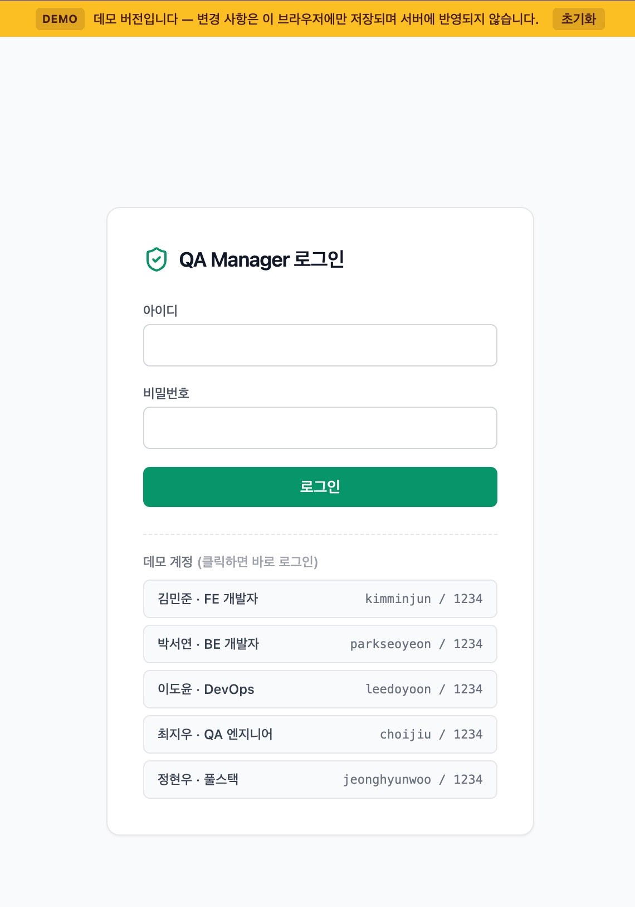

# 데모 모드

백엔드 · DB 없이 **프론트엔드 정적 빌드만으로** 동작하는 체험판입니다.

**🔗 라이브 데모: https://qa-manager-demo.cygnus2.com**



## 사용 방법

- 로그인 화면 하단의 **데모 계정 목록을 클릭**하면 바로 로그인됩니다 (전원 비밀번호 `1234`)
- 상단에 노란 데모 배너가 표시되며, `초기화` 버튼으로 언제든 시드 상태로 되돌릴 수 있습니다
- 변경한 데이터는 **방문자 브라우저(localStorage)에만** 저장됩니다 — 서버도, 다른 방문자도 영향받지 않습니다

## 동작 방식

- `DEMO_BUILD=true` 빌드 시 `ssr: false` 로 전환되고, API 클라이언트(`$api`)가 통째로 **localStorage 기반 mock**(`frontend/app/demo/`)으로 교체됩니다
  - `demo/api.ts` — 정규식 라우트 테이블로 실제 REST 경로 전체를 매핑
  - `demo/seed.ts` — 멤버 5명 · 프로젝트 4개 · 업데이트 7개 · QA 9건 · 코멘트 · GitHub repo/커밋 시드
  - `demo/db.ts` — 상태 전체를 localStorage 에 직렬화
- 파일 업로드는 S3 대신 브라우저 안에서 data URL 로 처리됩니다
- 실서비스와 **같은 화면 코드**를 그대로 사용하므로, 데모에서 보이는 UI = 실제 UI 입니다

## 제한 사항

| 항목 | 데모에서의 동작 |
|---|---|
| 멤버 CRUD · 비밀번호 초기화 · Teams 테스트 · GitHub App 생성/해제 | `403 DEMO_READONLY` ("데모 모드에서는 사용할 수 없는 기능입니다") |
| 실시간 알림 (SSE) | 미동작 (알림 목록 비어 있음) |
| QA 변경 이력 | 비어 있음 |
| GitHub 연동 | 항상 연동된 것처럼 표시 (시드 repo · 가짜 커밋) |
| 로그인 | 시드 계정만 허용, 비밀번호 검증 없음 |

## 빌드 · 배포

```bash
# 정적 빌드 → .output/public 아무 정적 호스팅에나 배포 가능
cd frontend
DEMO_BUILD=true npm run generate
```

Docker 로 서빙하려면 (운영 스택과 완전히 분리된 단일 컨테이너, `.env` 불필요):

```bash
docker compose -f docker-compose.demo.yml up -d --build
# 127.0.0.1:8070 에만 바인딩 — 앞단 nginx(443)가 프록시
```

- 정적 서빙 설정: `frontend/Dockerfile.demo` + `frontend/nginx.demo.conf` (SPA fallback, 정적 자산 장기 캐시, 색인 차단 헤더)
- 공개용 리버스 프록시 예시: [nginx.demo.example.conf](nginx.demo.example.conf) (TLS + Let's Encrypt)
