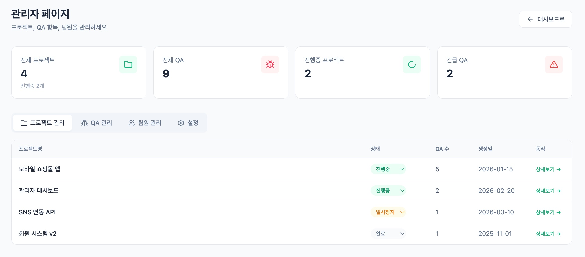

# 기능 상세 가이드

QA Manager 의 모든 기능을 화면 단위로 정리한 문서입니다.

> 🖼️ 스크린샷은 `docs/images/` 에 파일을 추가하면 표시됩니다. 파일명 목록: [images/README.md](images/README.md)

## 목차

1. [대시보드](#1-대시보드)
2. [프로젝트 관리](#2-프로젝트-관리)
3. [업데이트(버전) 관리](#3-업데이트버전-관리)
4. [QA 항목](#4-qa-항목)
5. [QA 상세 페이지](#5-qa-상세-페이지)
6. [테스트 케이스 관리](#6-테스트-케이스-관리)
7. [코멘트](#7-코멘트)
8. [알림](#8-알림)
9. [파일 첨부](#9-파일-첨부)
10. [인증 · 보안](#10-인증--보안)
11. [설정 · 관리자 페이지](#11-설정--관리자-페이지)
12. [다국어 · 다크모드](#12-다국어--다크모드)
13. [외부 연동 · 데모](#13-외부-연동--데모)

---

## 1. 대시보드

`/` 첫 화면. 팀의 QA 현황을 한눈에 보여줍니다. 프로젝트 목록은 왼쪽 **앱 사이드바**로 옮겨져, 프로젝트가 많아져도 첫 화면을 차지하지 않습니다.

- **앱 사이드바** — 위에 메뉴(대시보드 · 알림 · 관리), 아래에 프로젝트 목록. 📌 고정한 프로젝트가 먼저 오고, 완료 프로젝트는 흐리게, 빨간 숫자는 그 프로젝트의 **새 알림 수**(프로젝트를 열거나 알림을 읽으면 지워짐). 프로젝트를 누르면 그 자리에서 펼쳐져 **개요 · 테스트 케이스 · 테스트 플로우 · 테스트 런** 하위 메뉴가 나옵니다. 프로젝트가 많으면 검색 아이콘으로 이름을 걸러 찾습니다
  - 헤더 아이콘 또는 `⌘/Ctrl+B` 로 56px 아이콘 스트립으로 접힘(브라우저에 기억). **QA 상세에서는 자동으로 접히고** 나가면 복원. 모바일(768px 미만)은 햄버거 → 드로어
  - 하단 패널: 내 프로필(→ 설정) · 테마 · 설정 · 로그아웃
- **QA 현황 요약 카드** — 전체 건수 · 완료율, 상태 6종(수정필요/진행중/수정완료/확인완료/보류/추가확인필요) 비율 바 + 건수, 긴급(우선순위) 건수를 한 장에
  - `내 작업만` 체크박스로 내가 담당한 QA 기준 수치로 전환 (서버 집계 API 사용, 최초 1회만 조회 후 캐시)
- **전체 QA 목록** — 서버 페이징(10/50/100건), 검색 · 상태 · 우선순위 · 업데이트 · 테스터/담당자 필터, `배포완료 숨기기`. 프로젝트 이름 열 포함
  - 목록에서 적용한 필터는 QA 상세의 사이드바로 그대로 이어집니다 (sessionStorage 공유)

## 2. 프로젝트 관리

- 프로젝트 CRUD, 상태 3단계 (`active` 진행중 / `paused` 일시중지 / `completed` 완료)
- 프로젝트 상세(`/project/:id`) — 사이드바 하위 메뉴로 화면 전환: **개요**(헤더 + QA 현황 요약 + 업데이트별 QA) / **테스트 케이스** / **테스트 플로우** / **테스트 런**(프로젝트의 런 목록)
  - 헤더에서 상태 즉시 변경, 📌 상단 고정 토글, 진행률 바, 줄바꿈 보존 + 더보기/접기 설명
  - 업데이트별 QA 아코디언 — 헤더에 상태별 QA 개수 배지, 행에서 QA 상태 인라인 변경
  - `배포완료 숨기기` 토글로 릴리즈된 업데이트 접기
- **GitHub 저장소 다중 연결** — GitHub App 연동 시 프로젝트당 여러 repo 를 체크박스로 연결 ([상세](GITHUB_INTEGRATION.md))

## 3. 업데이트(버전) 관리

- 프로젝트 하위에 릴리즈 버전 단위로 생성 (버전 / 제목 / 설명 / 상태 3단계: 진행중 · 테스트중 · 배포완료)
- **드래그 순서 변경** — `순서 변경` 모달에서 그립 핸들로 끌어서 정렬, 저장 시 일괄 반영 (vuedraggable)
- QA 상세에서 QA 를 **다른 업데이트로 이동** 가능 (버전 셀렉트에서 선택 즉시 반영)

## 4. QA 항목

- **상태 6단계**: 수정필요 → 진행중 → 수정완료 → 확인완료, 그 외 보류 / 추가확인필요
- **우선순위 4단계**: 낮음 / 보통 / 높음 / 긴급
- **담당 구조**: 테스터 1명 + 담당자 2명 — 검색형 셀렉트로 목록/상세 어디서든 즉시 변경
- 카테고리(자유 태그), QA 번호(`QA #123`) 노출
- **`#번호` QA 상호참조** — 설명/코멘트 입력 중 `#` 를 치면 QA 자동완성 드롭다운이 뜨고, 본문의 `#123` 은 해당 QA 로 가는 새 탭 링크로 렌더링
- **변경 이력 자동 기록** — 제목 · 설명 · 상태 · 우선순위 · 담당자 · 업데이트 이동 · 이미지 추가/삭제까지 필드 단위 diff 로 타임라인 표시
- QA 생성 시 **GitHub 이슈 동시 생성** 체크박스 (연결 repo 가 있는 프로젝트에서만 노출)

## 5. QA 상세 페이지

`/qa/:id`. 좌측 목록 사이드바 / 중앙 본문 + 코멘트 / 우측 변경 이력의 3분할 마스터-디테일 뷰입니다.

- **QA 추적 바** — 상단에 `현재 / 전체` 위치와 이전/다음 버튼. 순서는 사이드바의 현재 필터 결과와 완전 동기화되며, 상세 간 이동은 히스토리에 쌓이지 않아 `뒤로` 한 번으로 목록에 복귀
- **목록 사이드바** — 검색 · 프로젝트 · 업데이트 · 상태 · 우선순위 필터(적용 개수 배지), 수동 새로고침, 선택 항목 자동 스크롤(페이지 스크롤 튐 방지)
- **사이드바 토글** — 좌/우 패널 모두 접기 가능, 접힌 상태는 세로쓰기 핸들로 남고 localStorage 에 유지
- **인라인 편집** — 편집 모드에 들어가지 않아도 상태 · 테스터/담당자 · 소속 업데이트를 셀렉트로 즉시 변경
- **GitHub 배지 · 커밋 목록** — 연결된 이슈 번호/상태 배지, 이슈를 참조한 커밋(sha · 메시지 · 작성자 · 날짜) 표시
- 페이지 리마운트 없이 항목 간 이동 (사이드바 스크롤/필터 상태 유지)

## 6. 테스트 케이스 관리

| 워크플로우 그래프 → 케이스 자동 생성 | 테스트 런 (플랫폼별 실행)         |
|--------------------------------------|-----------------------------------|
|  |  |

프로젝트 상세의 **테스트 케이스 탭**. 리스트 ↔ 플로우(그래프) 뷰를 전환하며 사용합니다.

### 케이스 라이브러리 (리스트 뷰)

- **스위트(폴더)** 로 그룹핑되는 프로젝트급 재사용 케이스 — 사이드바에서 추가/이름 변경/삭제(소속 케이스는 미분류로 이동)
- 케이스: 제목 · 사전 조건 · **스텝(행동/기대 결과)** 행 추가/이동/삭제 · 우선순위 4단계
- 플로우에서 생성된 케이스는 `플로우` 배지 표시, 원본 그래프가 바뀌면 `플로우 변경됨` 경고 배지

### 워크플로우 그래프 (플로우 뷰) — 모델 기반 테스팅

- 기획서의 워크플로우를 캔버스에 직접 그립니다 — 노드 3종(**화면 / 행동 / 분기**) + 시작/종료, 엣지에 분기 조건 라벨(예/아니오)
- 노드마다 **확인 포인트**(기대 결과)를 메모 → 생성되는 케이스의 기대 결과가 됩니다
- 노드에 **참고 이미지**(화면 시안/스크린샷) 첨부 — 캔버스에 썸네일 표시(클릭 시 확대), 케이스 생성 시 스텝에 전달되어 케이스 편집·런 실행 화면에서도 표시
- 에디터 단축키: `Del` 선택 삭제 · `Ctrl+Z`/`Ctrl+Shift+Z` 실행 취소/다시 실행 · `Ctrl+C/V` 노드 복사/붙여넣기
- **케이스 생성** — 시작→종료의 모든 경로를 열거(사이클 1회 순회 제한, 100개 상한)해 미리보기로 보여주고, 체크한 경로만 시나리오 케이스로 확정. 분기 선택이 제목에 표기됩니다 (`결제 화면 → OTP 인증 필요?(예) → OTP 입력 → 결제 완료`)
- 그래프를 수정해도 파생 케이스를 자동 재생성하지 않고 stale 표시만 — 사용자가 다듬은 케이스를 보호
- 플로우는 업데이트(릴리즈)에 연결 가능 — 케이스 생성 시 대상 스위트 이름으로 제안

### 테스트 런 (실행)

- 업데이트 아코디언에서 **새 테스트 런** — 이름 · 케이스 선택(스위트 그룹 체크박스) · **실행 플랫폼(PC/Android/iOS) 다중 선택**
- 플랫폼을 고르면 **케이스 × 플랫폼**으로 실행 항목이 확장 — 결과·메모·QA 링크가 플랫폼별로 독립 기록
- 런 생성 시 케이스를 **스냅샷** — 이후 원본 케이스가 수정/삭제돼도 실행 기록은 보존
- 실행 화면(`/run/:id`) — 좌측 케이스 목록(결과 아이콘 · 진행률 · 플랫폼 필터) + 중앙 스텝 테이블 · 결과 4종(통과/실패/차단/건너뜀) · 메모, `↑`/`↓` 키보드 이동, 런 종료/재열기
- **실패 → QA 항목 원클릭 생성** — 케이스 제목·스텝·메모가 프리필된 QA 생성 모달이 열리고, 생성된 QA 가 실행 항목에 링크됩니다 (기존 Teams 알림 · GitHub 이슈 파이프라인 그대로 연결)

## 7. 코멘트

- 루트 코멘트 + 1-depth 답글 스레드, 본인 코멘트만 인라인 수정/삭제
- **`@멘션`** — 이름 자동완성(아바타 · 역할 표시, 방향키/Enter), 멘션된 멤버에게 알림 발송. 전송 직전 본문에 실제로 남아있는 멘션만 집계
- **`#` QA 태그** — 멘션과 동일한 자동완성으로 다른 QA 참조 삽입
- **이모지 반응 8종** (👍 👎 👀 🎉 😄 ❤️ 🤔 🚀) — 토글 방식, 내가 누른 반응은 강조 표시
- **첨부** — 이미지 + PDF 다중 첨부, **클립보드 붙여넣기 즉시 업로드**, 이미지 클릭 시 라이트박스
- **단축키** — `Ctrl(⌘)+Enter` 로 등록/저장/답글, 500자 제한 실시간 카운터

## 8. 알림

### 인앱 실시간 알림 (SSE)

| 이벤트 | 수신자 |
|---|---|
| QA 신규 등록 | 테스터 + 담당자 1·2 |
| QA 상태 변경 | 테스터 + 담당자 1·2 |
| 담당자 배정/변경 | 새로 지정된 본인 |
| 코멘트 작성 | 테스터 + 담당자 1·2 |
| 내 코멘트에 답글 | 부모 코멘트 작성자 |
| `@멘션` | 멘션된 멤버 |

- 자기 자신이 발생시킨 이벤트는 발송 제외, 수신자 중복 자동 제거
- **알림 구성** — 제목은 QA 제목, 본문은 이벤트 문구. 코멘트/답글/멘션은 본문에 댓글 내용 발췌(최대 200자)가 붙어 알림만 봐도 내용을 알 수 있습니다
- **알림 페이지(`/notifications`)** — 사이드바 알림 메뉴(안읽음 배지)로 진입. Teams 활동 피드처럼 왼쪽에 목록(제목 · 문구+댓글 발췌 · 보낸 사람 · 프로젝트 · 시각, 전체/안읽음/멘션 필터, **모두 읽음 처리**), 오른쪽에 고른 알림의 QA 정보와 코멘트를 그 자리에서 보여주고 `상세 페이지 열기`로 전체 화면 이동. 모바일은 목록만 보이고 누르면 QA 상세로 이동
- 알림을 열면 읽음 처리되고, **QA 상세 페이지를 열면 그 QA 의 안읽은 알림은 자동으로 읽음 처리**됩니다
- 다중 탭/기기 동시 구독 지원. 연결이 끊기면 자동 재연결(1초→최대 30초 백오프)하고 놓친 알림을 재조회하며, 서버가 25초마다 보내는 keep-alive 가 90초 동안 없으면 죽은 연결로 보고 다시 붙습니다

### 데스크톱 앱 알림

[qa-manager-desktop](https://github.com/cygnus970209/qa-manager-desktop) 을 쓰면 위 알림이 **OS 네이티브 알림**으로도 옵니다.

- 창을 닫아도 트레이에 남아 알림을 계속 받고, 안읽음 수가 앱 아이콘 뱃지로 표시됩니다 (macOS/Linux)
- **알림을 클릭하면 앱 창이 열리며 해당 QA 상세로 이동**하고 읽음 처리됩니다
- macOS 는 첫 실행 때 알림 허용을 묻고, 알림이 꺼져 있으면 시스템 설정으로 안내합니다
- 새 버전은 앱이 스스로 확인해 다이얼로그로 안내하고, "지금 업데이트"를 누르면 설치 후 재시작됩니다 (트레이 메뉴 "업데이트 확인")
- 웹앱은 데스크톱이 주입하는 `window.__QAM_DESKTOP__` 브리지가 있을 때만 이를 사용하므로 브라우저에서는 아무 영향이 없습니다

### MS Teams 봇 알림

- 위 알림이 Teams 1:1 채팅으로도 발송 (Adaptive Card + "QA 열기" 딥링크)
- **알림 개인화**: 종류별(QA/코멘트/답글) on/off + **방해금지 시간대**(자정 넘김 지원) — Teams 발송에만 적용, 인앱 알림은 항상 저장
- 설정 → MS Teams 탭에서 `내게 테스트 발송` 으로 6단계 진단 가능 → [설정 가이드](TEAMS_INTEGRATION.md)

## 9. 파일 첨부

- **S3 presigned URL 직접 업로드** — 파일이 백엔드 서버를 경유하지 않음
- 허용 타입: 이미지(jpeg/png/gif/webp/avif) + **PDF** (아바타는 이미지만)
- 용량 제한 기본 **100MB** — 프론트 사전 검증 + 백엔드 presign 검증 + S3 서명 검증 3중
- 이미지 라이트박스: 휠 줌(0.25~8배) · 드래그 이동 · ←/→ 이전/다음 · `0` 리셋
- PDF 는 파일명 카드로 표시, 클릭 시 새 탭

## 10. 인증 · 보안

- **계정 권한 2단계 (관리자/멤버)** — 관리자만 관리 페이지 접근 · 팀원 관리 · 권한 부여 · 전역 연동(GitHub) 설정 변경 가능. 자기 자신의 권한 변경/삭제는 차단되어 관리자 0명 잠금이 구조적으로 방지됩니다. 기존 설치본은 마이그레이션 시 전원 관리자로 시작 → 팀원 관리 탭에서 조정
- **JWT HttpOnly 쿠키** (access 15분 + refresh 14일), refresh rotation, 로그아웃/회전 시 Redis 블랙리스트
- **IP 조건부 이메일 OTP 2FA** — 신뢰 IP(사무실 CIDR)에서는 비밀번호만으로, 그 외에서는 이메일 6자리 코드 검증 후 토큰 발급
  - 재전송 60초 쿨다운, 5회 시도 제한, 10분 만료, 남은 시도 횟수 표시
  - 기본 비활성(`SECURITY_IP_OTP_ENABLED=false`) — 설계 문서: [SECURITY_IP_OTP_LOGIN.md](SECURITY_IP_OTP_LOGIN.md)
- **프로필** — 아바타 업로드(미리보기), 이름 변경, 현재 비밀번호 확인 후 비밀번호 변경
- **API 감사 로그** — 모든 쓰기 요청(메서드 · 경로 · 사용자 · IP · 소요시간 · 에러)을 비동기 적재, 요청 본문은 저장하지 않음
- 팀원 삭제는 **소프트 삭제** — 코멘트/이력/알림 보존, 로그인만 차단
- 검색엔진 색인 차단(robots + X-Robots-Tag), CSP · X-Frame-Options 등 보안 헤더

## 11. 설정 · 관리자 페이지

### 설정 (`/settings/*`)

사이드바 하단 톱니바퀴(또는 내 프로필)로 진입. 앱 사이드바 없이 **전체 화면**으로 열리고 `ESC` 또는 오른쪽 위 닫기로 들어오기 전 화면에 돌아갑니다. 왼쪽 메뉴는 세 묶음:

| 묶음 | 항목 |
|---|---|
| 사용자 설정 | **내 계정**(프로필 이미지 · 이름 · 비밀번호 변경) / **알림**(종류별 토글 + 방해금지 시간대) / **MS Teams**(수신 마스터 토글 · 봇 설치 안내 · 나에게 테스트 발송 → 6단계 진단 모달) |
| 앱 설정 | **모양**(시스템/라이트/다크 테마) / **언어**(한국어/English) / **데스크톱 앱**(버전 · 업데이트 확인 · 알림 권한 — 데스크톱 앱에서만, 브라우저에서는 내려받기 안내) |
| 관리자 (ADMIN 만 노출) | **팀원 관리**(추가/수정/삭제(본인 차단), **권한 부여(관리자/멤버)**, **비밀번호 초기화**, **Teams 발송 테스트**) / **GitHub 연동**(GitHub App 원클릭 생성 → 연동 상태 · 연결 저장소 목록 · 연동 해제) |

### 관리자 페이지 (`/admin`)

**관리자 전용** (일반 멤버는 사이드바에 노출되지 않고 접근 시 대시보드로 리다이렉트). 상단 통계 카드 4종(전체 프로젝트 / 전체 QA / 진행중 프로젝트 / 긴급 QA) + 2개 탭:

| 탭 | 기능 |
|---|---|
| 프로젝트 관리 | 목록 · 상태 인라인 변경 · QA 수 |
| QA 관리 | 목록 · 우선순위/상태 인라인 변경 · 담당자 |

## 12. 다국어 · 다크모드

- **한국어/영어** — 브라우저 언어 자동 감지 + 쿠키 기억, 설정 > 언어 · 로그인 화면에서 즉시 전환
- 데모는 **시드 데이터까지 언어별 제공** — 영어 방문자는 첫 화면부터 영어 데이터로 체험
- **다크모드** — 시스템/라이트/다크 3단 선택(설정 > 모양, 사이드바 하단 테마 버튼), OS 설정 자동 추종, 첫 페인트 깜빡임(FOUC) 방지, 전 화면 지원

## 13. 외부 연동 · 데모

- **GitHub 연동** — 이슈 자동 생성 / 상태 동기화 / 커밋 추적: [GITHUB_INTEGRATION.md](GITHUB_INTEGRATION.md)
- **MS Teams 봇** — Azure Bot 준비부터 사용자 설치까지: [TEAMS_INTEGRATION.md](TEAMS_INTEGRATION.md)
- **데모 모드** — 백엔드 없이 정적 배포되는 체험판: [DEMO.md](DEMO.md)
